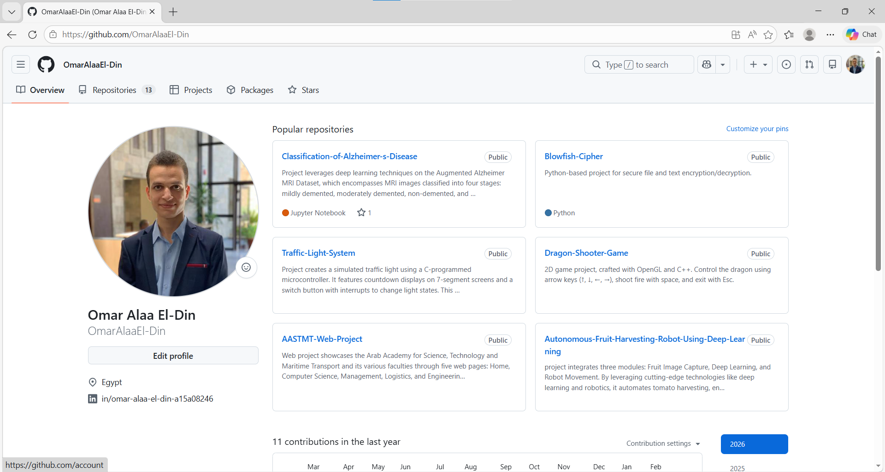
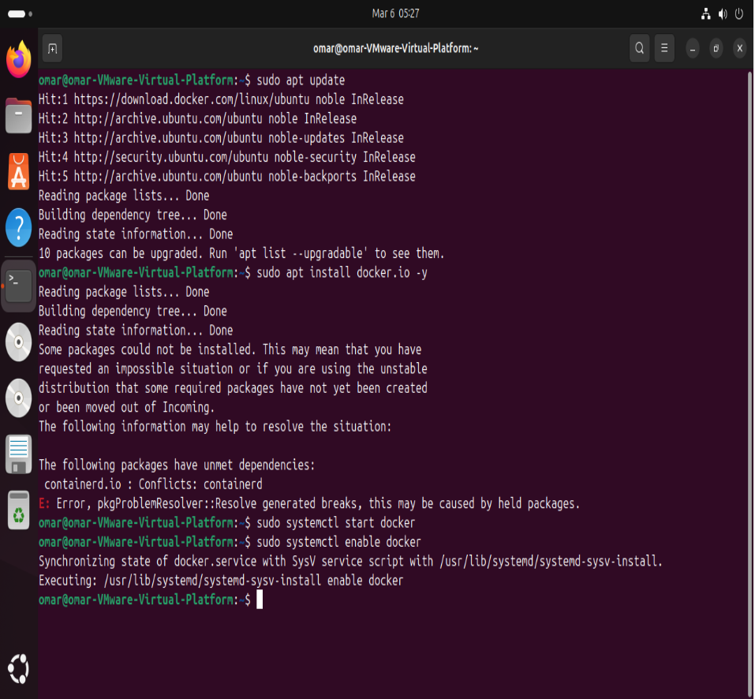
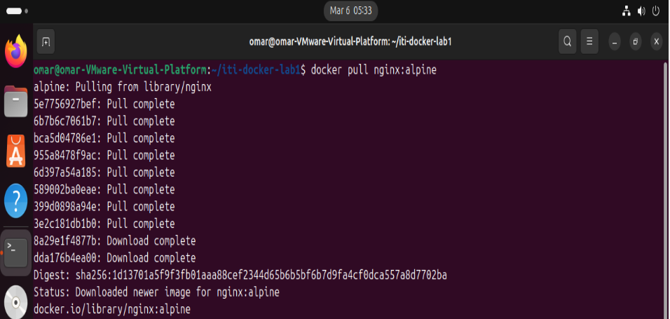
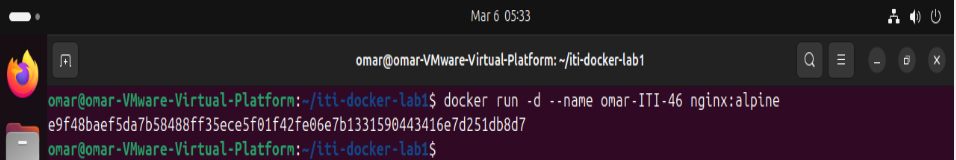
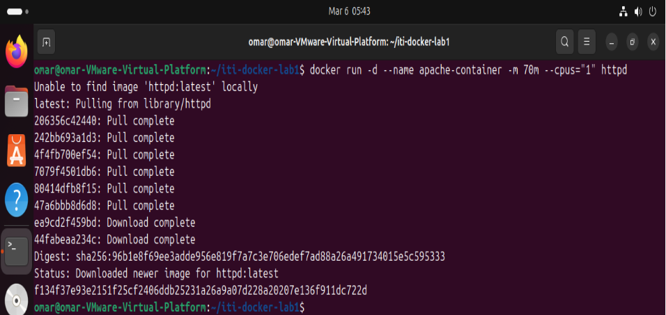
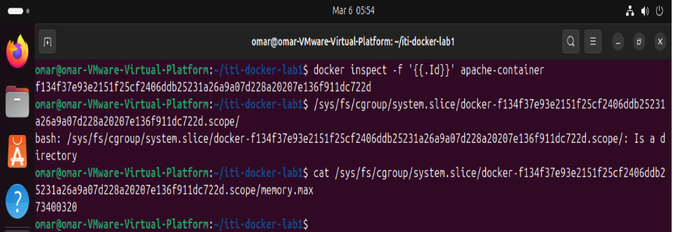

# ITI Docker Lab 1 Report

1.  **Make a GitHub account with your name:**
    Created a personal GitHub account. The profile is visible on the web.

    
    *Result: Image shows the profile page of Omar Alaa El-Din.*

2.  **Download and install Docker on your machine:**
    Attempted to install Docker using `apt`.

    
    *Result: Shows the `apt update` process, followed by an `apt install docker.io` attempt. It also shows attempting to start and enable the docker service.*

3.  **Pull the `nginx:alpine` image on your machine:**
    Successfully downloaded the `nginx:alpine` image to the local Docker image repository.

    
    *Result: Shows the terminal output for the `docker pull nginx:alpine` command, with all layers pulled and the image successfully downloaded.*

4.  **Explore `docker run` command and run `nginx:alpine` image on your machine in the background and specify the name of the container to `omar-ITI-46`:**
    Explored the `docker run` command and executed the Nginx image in detached (background) mode. The specified naming convention `omar-ITI-46` was applied to the container.

    
    *Result: Shows the `docker run -d --name omar-ITI-46 nginx:alpine` command and the resulting long container ID.*

5.  **Run apache container with apache image with memory limit 70 MB and 1 core of CPU:**
    Executed an Apache container (using the `httpd` image) with specific resource constraints. The container was named `apache-container`, with a memory limit of 70 megabytes (`-m 70m`) and a CPU limit of 1 core (`--cpus="1"`).

    
    *Result: Shows the `docker run` command, the automatic pulling of the `httpd:latest` image (since it wasn't present locally), and the container ID for the running Apache container.*

6.  **After creating the containers, make sure to get the path of the cgroups created for this container and memory limit file and value:**
    Retrieved the cgroups path and verified the applied memory limit in the cgroups filesystem. The container ID was retrieved via `docker inspect`. The correct cgroup scope path was identified, and the value of `memory.max` was read.

    
    *Result: The screenshot shows three key steps:*
    * *First command: `docker inspect -f '{{.Id}}' apache-container` to get the full container ID.*
    * *Second part: Finding the full cgroup path: `/sys/fs/cgroup/system.slice/docker-f134f37e93e2151f25cf2406ddb25231a26a9a07d228a20207e136f911dc722d.scope/` and the subsequent error "Is a directory".*
    * *Third command: `cat .../memory.max` which displays the value `73400320`. (This value is exactly 70MB in bytes: 70 * 1024 * 1024 = 73,400,320), thus verifying the memory limit instruction.*
